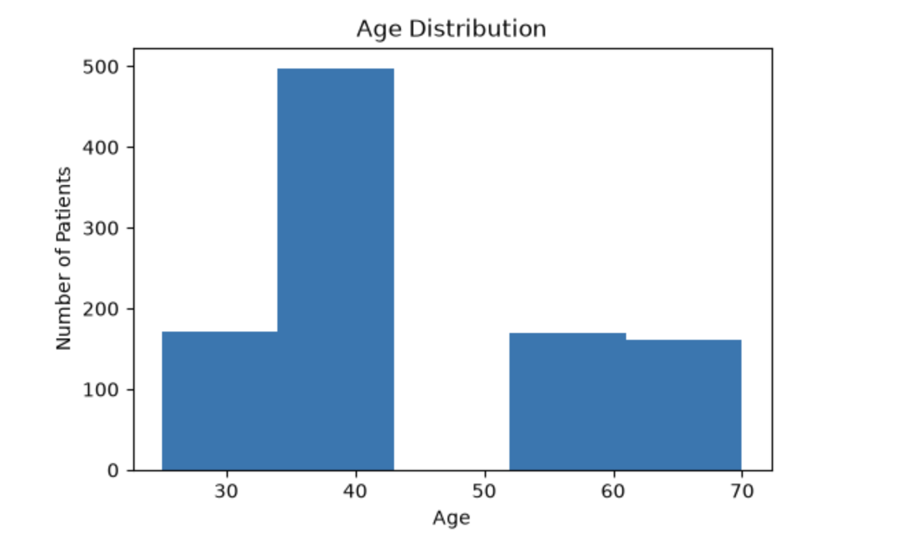
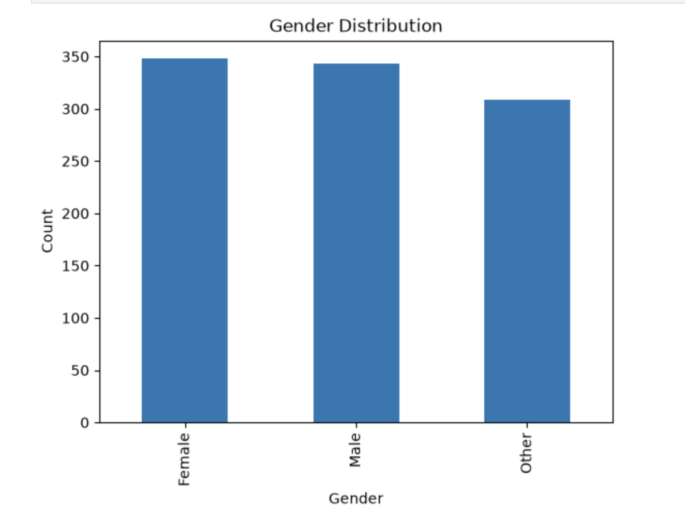
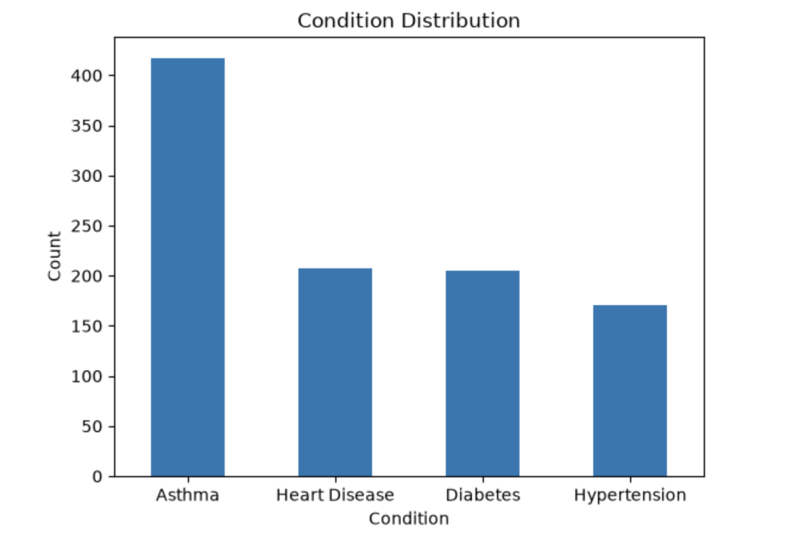
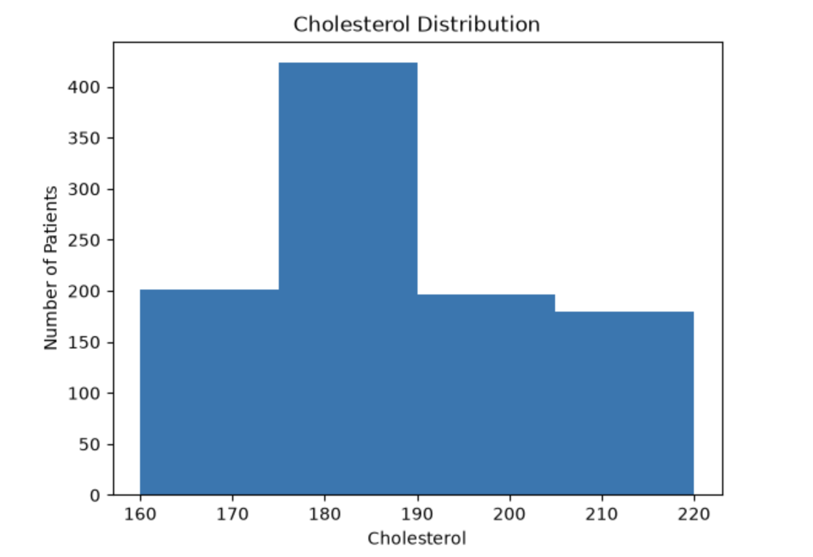
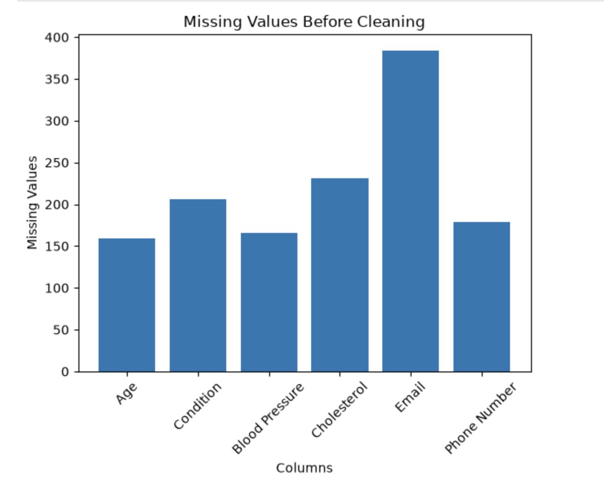

# Data Cleaning Report

## Project Information

**Project:** Healthcare Dataset Cleaning

**Tools Used:**
- Python
- Pandas
- Matplotlib
- Numpy
- Jupyter Notebook

---

# Project Overview

The objective of this project was to clean a messy healthcare dataset by identifying and resolving common data quality issues before performing any analysis or machine learning. The dataset contained missing values, inconsistent formatting, invalid data entries, and mixed data types. Each cleaning decision was made based on the nature of the data rather than applying a single technique to every column.

---

# Dataset Overview

- **Rows:** 1000
- **Columns:** 10

The dataset contains healthcare related information including patient names, age, gender, medical condition, medication, visit date, blood pressure, cholesterol level, email address, and phone number.

| Column |
|---------|
| Patient Name |
| Age |
| Gender |
| Condition |
| Medication |
| Visit Date |
| Blood Pressure |
| Cholesterol |
| Email |
| Phone Number |

---

# Data Types 

| Column | Data Type |
|---------|-----------|
| Patient Name | string |
| Age | int |
| Gender | string |
| Condition | string |
| Medication | string |
| Visit Date | datetime64 |
| Blood Pressure | string |
| Cholesterol | int |
| Email | string |
| Phone Number | string |

---

# Missing Value Analysis

| Column | Missing Before | Missing % | Handling Decision | Reason |
|---------|---------------:|----------:|-------------------|--------|
| Patient Name | 0 | 0.0% | No action required | No missing values |
| Age | 159 | 15.9% | Filled using Median | Numeric column; median is robust to skewed data |
| Gender | 0 | 0.0% | No action required | No missing values |
| Condition | 206 | 20.6% | Filled using Mode | Categorical column; mode preserves existing categories |
| Medication | 0 | 0.0% | No action required | No missing values |
| Visit Date | 0 | 0.0% | Standardized format | Dates were stored in multiple formats |
| Blood Pressure | 166 | 16.6% | Filled using Mode | Stored as categorical blood pressure readings |
| Cholesterol | 231 | 23.1% | Filled using Median | Numeric column; median is resistant to skewness |
| Email | 384 | 38.4% | Left Missing | Unique identifier; cannot be meaningfully imputed |
| Phone Number | 179 | 17.9% | Left Missing | Unique identifier; cannot be meaningfully imputed |

---

# Data Quality Issues Found

## 1. Invalid Numeric Values

### Problem

The **Age** column contained text values such as:

```
forty
```

instead of numeric values.

### Solution

The invalid value was replaced with its numeric equivalent (`40`), and the entire column was converted to a numeric data type using `pd.to_numeric()`.

---

## 2. Leading and Trailing Spaces

### Problem

Several text columns contained unnecessary spaces.

Example:

```
" david lee "
```

### Solution

Leading and trailing spaces were removed from every text column using:

```python
str.strip()
```

---

## 3. Mixed Date Formats

### Problem

The **Visit Date** column contained multiple date formats, including:

```
01/15/2020
April 5, 2018
2019.12.01
2020/02/20
03-25-2019
```

### Solution

The column was converted to a standard datetime format using:

```python
pd.to_datetime(..., format="mixed")
```

---

## 4. Missing Values

### Problem

Several columns contained missing values.

### Solution

Each column was handled differently according to its data type:

- Numeric columns → Median
- Categorical columns → Mode
- Identifier columns → Left as missing

---

# Duplicate Analysis

Duplicate rows were checked using:

```python
df.duplicated().sum()
```

### Result

No duplicate rows were found in the dataset.

---

# Outlier Detection

The **Interquartile Range (IQR)** method was used to identify outliers in:

- Age
- Cholesterol

### Result

No significant outliers were detected.

---

# Data Cleaning Summary

The following cleaning operations were performed:

- Corrected invalid age values.
- Converted the Age column to numeric.
- Removed leading and trailing spaces from text columns.
- Standardized Visit Date into a consistent datetime format.
- Filled missing Age values using the median.
- Filled missing Condition values using the mode.
- Filled missing Blood Pressure values using the mode.
- Filled missing Cholesterol values using the median.
- Retained missing Email values because email addresses are unique identifiers.
- Retained missing Phone Number values because phone numbers are unique identifiers.
- Checked for duplicate rows.
- Performed outlier detection using the IQR method.

---

# Final Dataset Status

| Check | Status |
|-------|--------|
| Missing values handled | Yes (except Email and Phone Number) |
| Invalid values corrected | Yes |
| Data types corrected |  Yes |
| Date formats standardized |  Yes |
| Duplicate rows removed | No duplicates found |
| Outlier analysis completed | Yes |

---

# Visualizations

## 1. Age Distribution



**Observation**

Most patients are between 35 and 60 years old.

---

## 2. Gender Distribution



**Observation**

The dataset contains Male, Female, and Other categories.

---

## 3. Condition Distribution



**Observation**

Asthma is the most common medical condition.

---

## 4. Cholesterol Distribution



**Observation**

Most cholesterol values fall between 160 and 220.

---

## 5. Missing Values Before Cleaning



**Observation**

Email contains the highest number of missing values.

## 6. Relation 

| Condition        | Female | Male | Other |
|-----------------|--------|------|-------|
| Asthma          | 164    | 127  | 126   |
| Diabetes        | 68     | 80   | 57    |
| Heart Disease   | 65     | 74   | 68    |
| Hypertension    | 51     | 62   | 58    |


# Conclusion

The healthcare dataset was successfully cleaned and prepared for future analysis and machine learning tasks. Invalid values were corrected, inconsistent formatting was standardized, missing values were handled according to the characteristics of each feature, and duplicate and outlier checks were completed. Email addresses and phone numbers were intentionally left with missing values because they are unique identifiers and cannot be accurately inferred. The cleaned dataset is now in a consistent and reliable state for subsequent exploratory data analysis and model development.
