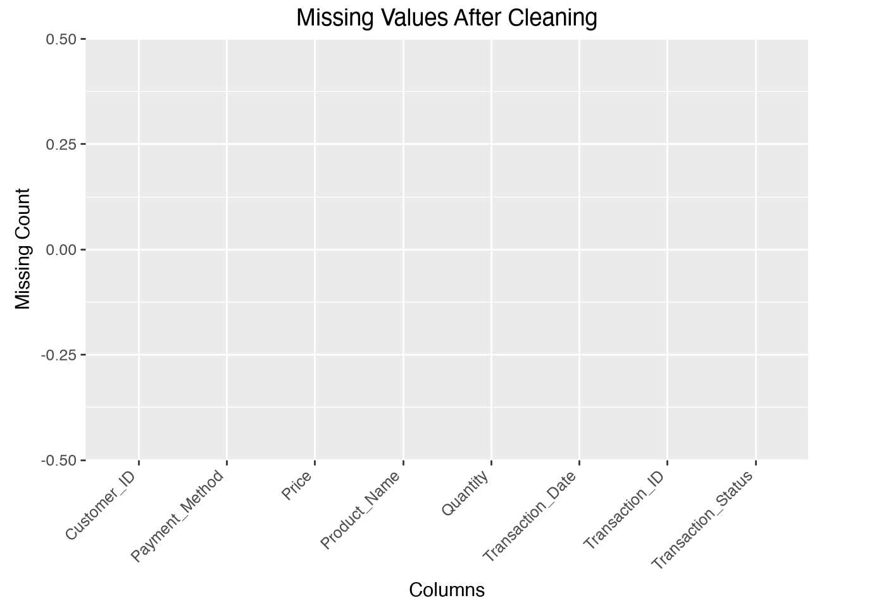
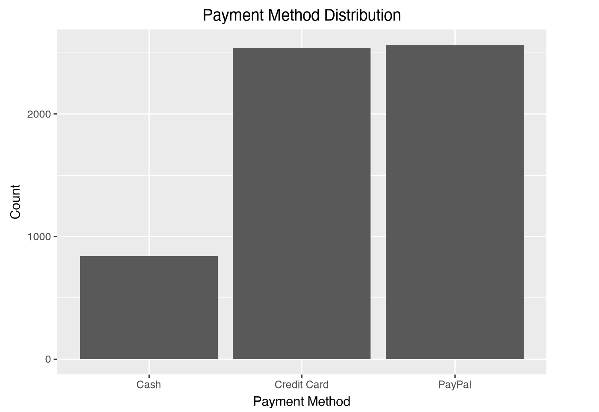
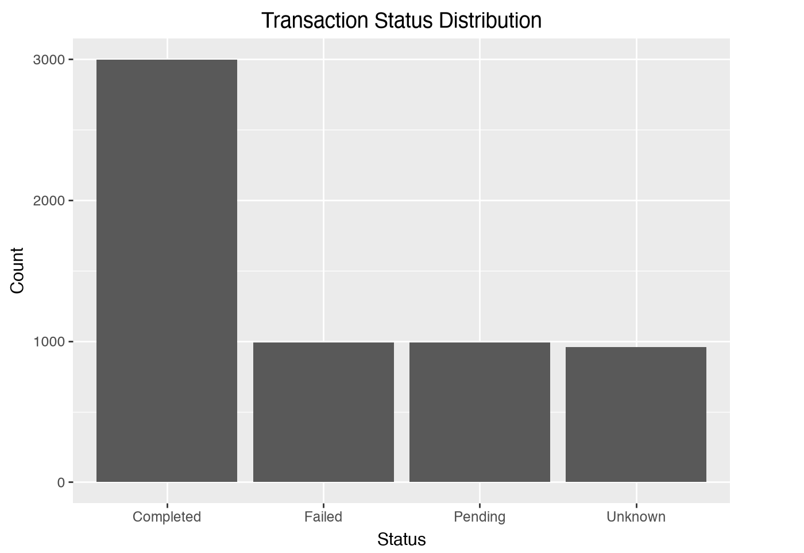
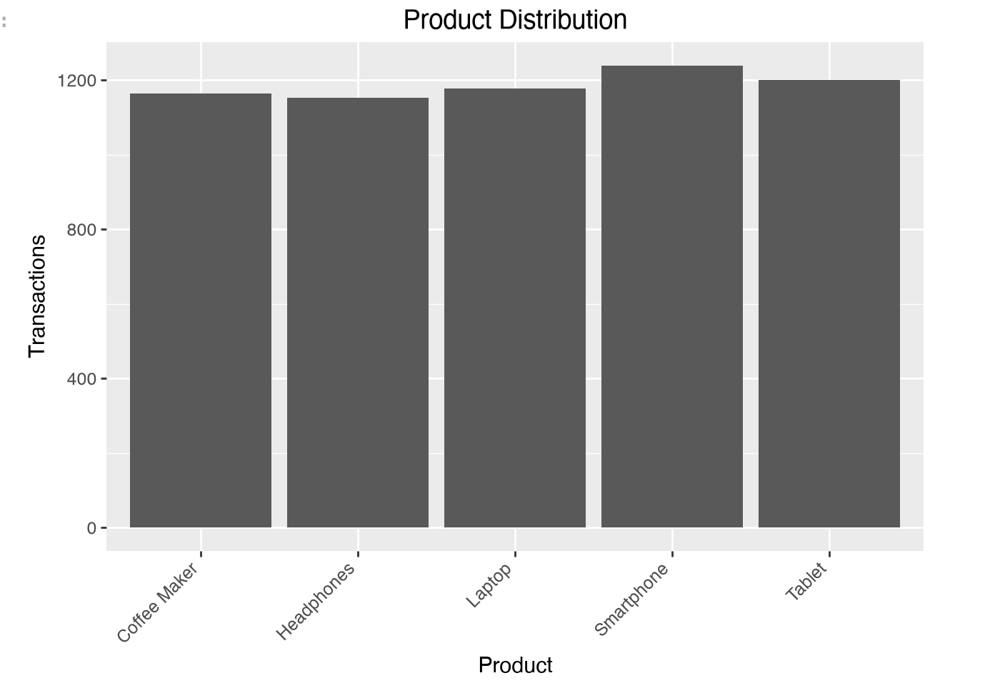
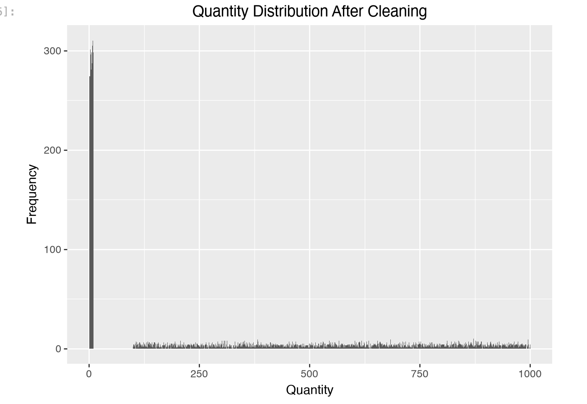
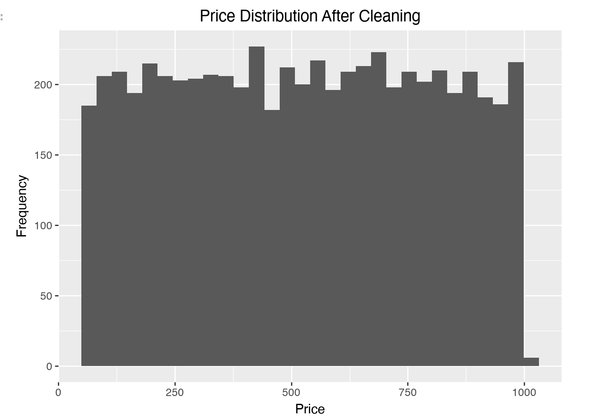
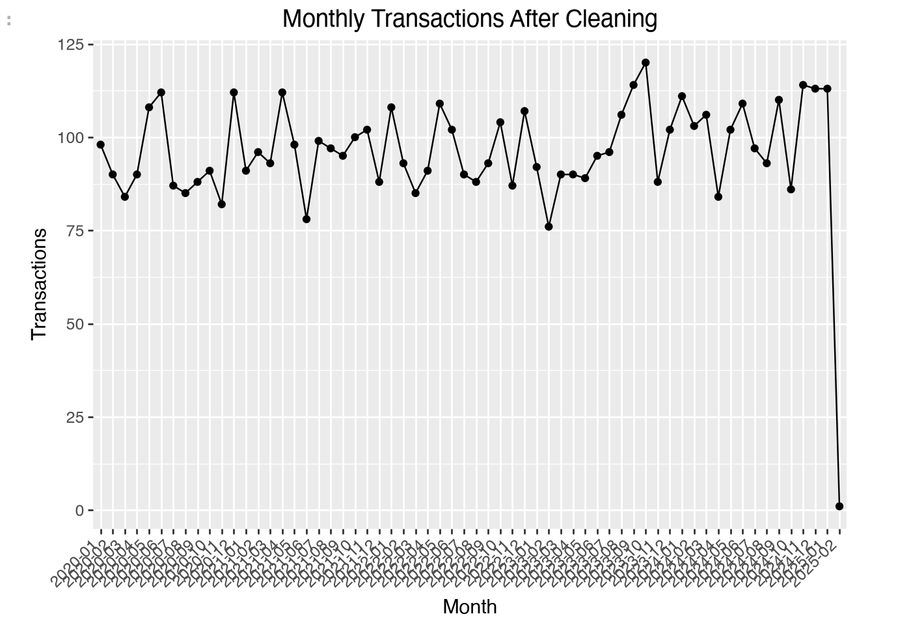
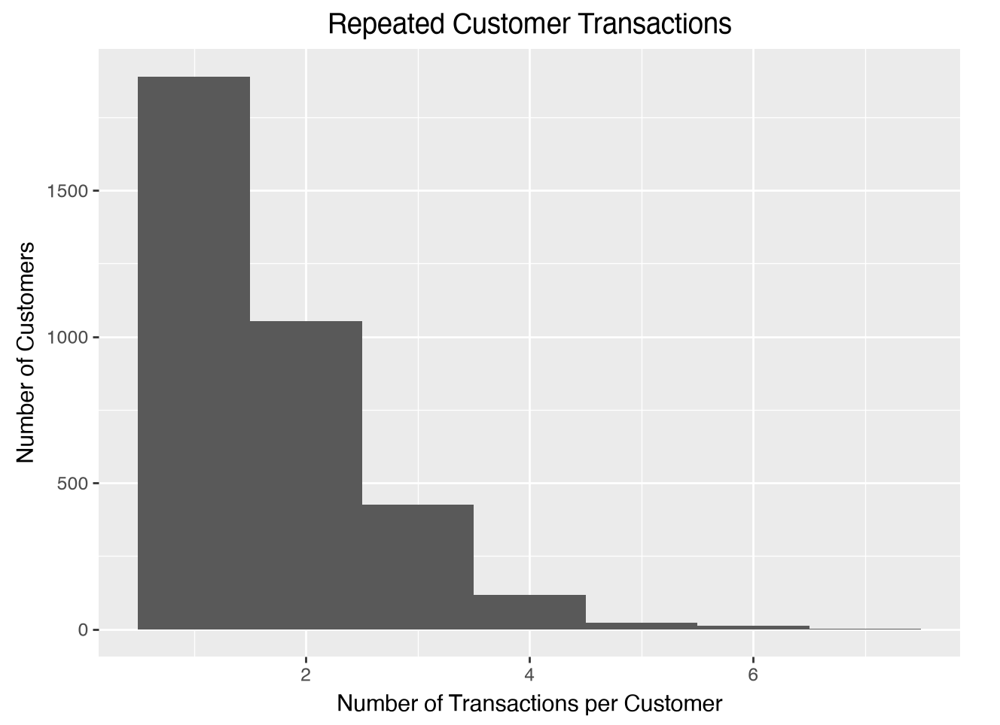
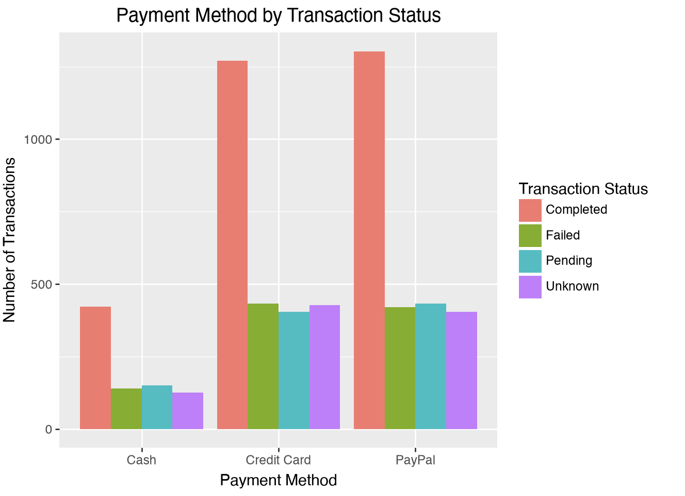
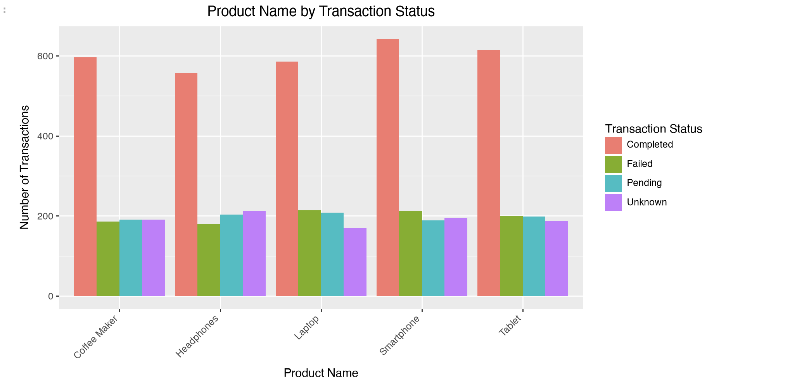

# Data Cleaning Report

---

# 1. Introduction

This report documents the data cleaning process performed on the financial transactions dataset. The objective was to correct data quality issues identified during the initial data quality assessment and prepare the dataset for reliable analysis and visualization.

---

# 2. Dataset Information

## 2.1 Dataset Source

The cleaned dataset was created from the original dirty financial transactions dataset.

## 2.2 Dataset Overview

The dataset contains financial transaction records including:

- Transaction information
- Customer information
- Product details
- Payment methods
- Transaction status

The cleaning process was performed without changing the overall structure of the dataset.

---

# 3. Data Cleaning Summary

The following data quality issues were successfully addressed during the cleaning process.

| Issue | Status |
|--------|--------|
| Missing Values | Fixed |
| Duplicate Records | Removed |
| Leading & Trailing Spaces | Removed |
| Incorrect Data Types | Corrected |
| Currency Symbols in Price | Removed |
| Thousand Separators | Removed |
| Mixed Date Formats | Standardized |
| Invalid Dates | Removed |
| Negative Prices | Removed |
| Negative Quantities | Removed |
| Zero Quantities | Removed |
| Inconsistent Payment Methods | Standardized |
| Inconsistent Transaction Status | Standardized |
| Truncated Product Names | Corrected |

---

# 4. Data Cleaning Process

## 4.1 Handling Missing Values

- Empty strings were converted to missing values.
- Missing values were identified and handled according to business requirements.
- Essential records containing missing critical information were removed.
- Missing transaction status values were replaced with **Unknown**.

---

## 4.2 Removing Duplicate Records

Duplicate transaction records were identified and removed to eliminate redundant observations.

---

## 4.3 Removing Leading and Trailing Spaces

Extra spaces were removed from all text columns to prevent duplicate categories.

---

## 4.4 Standardizing Text Formatting

Capitalization was standardized across all categorical columns to ensure consistency.

---

## 4.5 Standardizing Categorical Values

The following columns were standardized:

- Payment_Method
- Transaction_Status
- Product_Name

Different spellings, capitalizations, and formatting variations were converted into a single standard representation.

---

## 4.6 Correcting Product Names

Incomplete and truncated product names were mapped to their correct product names.

Examples include:

- Lapt → Laptop
- Coffee Ma → Coffee Maker
- Headp → Headphones
- Smar → Smartphone
- Tab → Tablet

Additional truncated variations were also standardized.

---

## 4.7 Cleaning the Price Column

The following corrections were applied:

- Removed currency symbols ($)
- Removed thousand separators (,)
- Converted Price to numeric format
- Removed negative prices
- Removed missing price values

---

## 4.8 Cleaning Transaction Dates

The Transaction_Date column was cleaned by:

- Converting mixed date formats into datetime format
- Removing invalid dates
- Standardizing the date format

---

## 4.9 Cleaning Quantity Values

The Quantity column was cleaned by:

- Removing negative quantities
- Removing zero quantities
- Converting values to integer format

---

# 5. Dataset Validation

After cleaning, the dataset was validated to ensure data quality.

The following checks were performed:

- Missing Values
- Duplicate Records
- Data Types
- Category Validation
- Invalid Values
- Quantity Validation
- Price Validation
- Date Validation

All validation checks confirmed successful data cleaning.

---

# 6. Data Quality Visualizations

## 6.1 Missing Values After Cleaning

This visualization confirms that missing values have been successfully handled, resulting in a complete dataset for further analysis.

---

## 6.2 Payment Method Distribution

This chart shows the standardized payment method categories after cleaning, eliminating inconsistent naming and formatting.

---

## 6.3 Transaction Status Distribution

This visualization displays the cleaned transaction status categories, ensuring consistent values across all records.

---

## 6.4 Product Distribution

This chart confirms that truncated and inconsistent product names have been standardized into their correct product categories.

---

## 6.5 Quantity Distribution

This histogram illustrates the distribution of valid transaction quantities after removing negative and zero values.

---

## 6.6 Price Distribution

This visualization shows the distribution of cleaned price values after removing formatting issues and invalid entries.

---

## 6.7 Monthly Transaction Trend

This line chart demonstrates that transaction dates have been successfully standardized, enabling reliable time-based analysis.

---

# 7. Exploratory Analysis of the Cleaned Dataset

## 7.1 Repeated Customer Transactions

| Customer_ID | Number_of_Transactions |
|-------------|-----------------------:|
| C4710 | 7 |
| C4308 | 6 |
| C3808 | 6 |
| C4361 | 6 |
| C694 | 6 |
| ... | ... |
| C2541 | 2 |
| C2064 | 2 |
| C3822 | 2 |
| C619 | 2 |
| C1678 | 2 |

---

## 7.2 Payment Method by Transaction Status

| Payment Method | Completed | Failed | Pending | Unknown |
|----------------|----------:|-------:|--------:|--------:|
| Cash | 422 | 140 | 151 | 125 |
| Credit Card | 1,271 | 432 | 405 | 427 |
| PayPal | 1,303 | 420 | 433 | 404 |

---

## 7.3 Product Name by Transaction Status

| Product Name | Completed | Failed | Pending | Unknown |
|--------------|----------:|-------:|--------:|--------:|
| Coffee Maker | 596 | 186 | 191 | 191 |
| Headphones | 557 | 179 | 203 | 213 |
| Laptop | 586 | 214 | 208 | 169 |
| Smartphone | 642 | 213 | 189 | 195 |
| Tablet | 615 | 200 | 198 | 188 |
---

# 8. Final Dataset Summary

After completing the cleaning process:

- Missing values were handled.
- Duplicate records were removed.
- Data types were corrected.
- Invalid dates were removed.
- Invalid prices were removed.
- Invalid quantities were removed.
- Product names were standardized.
- Payment methods were standardized.
- Transaction statuses were standardized.
- Formatting inconsistencies were eliminated.

The dataset is now suitable for reliable exploratory data analysis, visualization, dashboard development, and machine learning applications.

---

# 9. Conclusion

The financial transactions dataset was successfully cleaned and validated. All major data quality issues identified during the initial assessment were resolved, resulting in a consistent, accurate, and analysis-ready dataset. The cleaned dataset can now be confidently used for further analytical tasks, reporting, and predictive modeling.
