# Data Quality Assessment Report (Pre-Cleaning)

## 1. Dataset Overview
This dataset contains financial transaction records, including transaction details, customer information, purchased products, payment methods, and transaction statuses, and is intentionally messy for data cleaning and analysis practice.

---

## 2. Dataset Information
### 2.1 Dataset Source
The dataset was taken from kaggle: https://www.kaggle.com/datasets/alfarisbachmid/dirty-financial-transactions-dataset
### 2.2 Number of Rows and Columns
- Number of Rows   : 100000 
- Number of Columns: 8
### 2.3 Dataset Features (Columns)

- Transaction_ID
- Transaction_Date
- Customer_ID
- Product_Name
- Quantity
- Price
- Payment_Method
- Transaction_Status
### 2.4 Initial Data Types

| # | Column | Data Type |
|---:|---------------------|----------|
| 0 | Transaction_ID | String (`str`) |
| 1 | Transaction_Date | String (`str`) |
| 2 | Customer_ID | String (`str`) |
| 3 | Product_Name | String (`str`) |
| 4 | Quantity | Float (`float64`) |
| 5 | Price | String (`str`) |
| 6 | Payment_Method | String (`str`) |
| 7 | Transaction_Status | String (`str`) |
---

## 3. Initial Data Inspection
### 3.1 Dataset Preview
The dataset contains 100,000 financial transaction records with 8 columns. Each row represents a single transaction and includes information such as the transaction ID, transaction date, customer ID, product name, quantity purchased, price, payment method, and transaction status.
### 3.2 Basic Statistics
- The dataset consists of 100,000 rows and 8 columns.
- Numerical statistics are available mainly for the Quantity column.
- Most columns are stored as categorical (object) data.
- The Price column is stored as an object instead of a numeric data type, indicating possible formatting issues.
- The Transaction_Date column is also stored as an object rather than a datetime type.
### 3.3 General Observations
- The dataset contains both categorical and numerical features.
- Customer, product, payment, and transaction details are available for each record.
- Several columns show signs of data quality issues, including inconsistent formatting and incorrect data types.
- Missing values, duplicate records, invalid dates, inconsistent categorical values, and formatting problems are present.
- ata cleaning is required before performing reliable analysis or building machine learning models.

---

## 4. Data Quality Assessment
### 4.1 Missing Values
| Column | Missing Values | Missing Percentage (%) |
|---------------------|---------------:|-----------------------:|
| Transaction_ID | 5,018 | 5.02 |
| Transaction_Date | 4,880 | 4.88 |
| Customer_ID | 4,878 | 4.88 |
| Quantity | 5,019 | 5.02 |
| Price | 33,497 | 33.50 |
| Transaction_Status | 16,679 | 16.68 |
### 4.2 Duplicate Records
Duplicate Rows: 994
### 4.3 Incorrect Data Types
| Column | Current Data Type | Correct Data Type |
|------------------|-------------------|-------------------|
| Transaction_Date | `object` | `datetime` |
| Price | `object` | `float` |
### 4.4 Invalid Values
| Column | Invalid Values |
|---------------------|-------------------------------------------------------------------|
| Transaction_Date | `2025-02-30`, `2023-13-01` |
| Quantity | Negative values (e.g., `-5`, `-10`) |
| Price | Negative prices (e.g., `-445.34`) |
| Price | Values with `$` (e.g., `$420.21`, `$797.34`) |
| Product_Name | Abbreviated values such as `Tab`, `Coffee Ma`, `Cof`, `Smar`, `T`, `Headp`, `Lapt`, `C` |
| Transaction_Status | `completed`, `complete` |
| Payment_Method | `pay pal`, `PayPal `, `creditcard`, `credit card` |
### 4.5 Inconsistent Categorical Values
| Column | Inconsistent Values | Standard Value |
|---------------------|------------------------------------------------------|-----------------|
| Payment_Method | `Credit Card`, `credit card`, `creditcard`, `CREDIT CARD` | `Credit Card` |
| Payment_Method | `PayPal`, `PayPal `, `pay pal`, `paypal` | `PayPal` |
| Payment_Method | `Bank Transfer`, `bank transfer`, `BankTransfer` | `Bank Transfer` |
| Transaction_Status | `Completed`, `completed`, `complete` | `Completed` |
| Transaction_Status | `Pending`, `pending` | `Pending` |
| Transaction_Status | `Cancelled`, `cancelled` | `Cancelled` |
| Product_Name | `Laptop`, `Lapt` | `Laptop` |
| Product_Name | `Coffee Maker`, `Coffee Ma`, `Cof` | `Coffee Maker` |
| Product_Name | `Smartphone`, `Smar` | `Smartphone` |
| Product_Name | `Tablet`, `Tab`, `T` | `Tablet` |
| Product_Name | `Headphones`, `Headp` | `Headphones` |

Inconsistent categorical values were found in the Payment_Method, Transaction_Status, and Product_Name columns due to differences in capitalization, spacing, spelling, and truncated values representing the same category.
### 4.6 Formatting Issues
| Column | Formatting Issue | Example |
|---------------------|-------------------------------------|----------------------------------------------|
| Transaction_Date | Mixed date formats | `2024-05-12`, `12/05/2024`, `May 12, 2024` |
| Price | Currency symbols included | `$250.75`, `$1,200.50` |
| Price | Commas used as thousand separators | `1,250.00` |
| Payment_Method | Different capitalization | `PayPal`, `paypal`, `PAYPAL` |
| Payment_Method | Extra spaces | `PayPal `, `Credit Card` |
| Transaction_Status | Different capitalization | `Completed`, `completed`, `PENDING` |
| Product_Name | Inconsistent capitalization | `Laptop`, `laptop`, `LAPTOP` |
### 4.7 Negative or Impossible Values
| Column | Negative / Impossible Values |
|------------------|----------------------------------------------|
| Quantity | Negative values (e.g., `-3`, `-10`) |
| Price | Negative values (e.g., `-250.75`, `-99.99`) |
| Transaction_Date | Invalid dates (e.g., `2025-02-30`, `2023-13-01`) |
### 4.8 Empty Strings
| Column | Empty String Example |
|----------------------|----------------------|
| Product_Name | `""` |
| Payment_Method | `""` |
| Transaction_Status | `""` |
| Price | `""` |

---

## 5. Distribution Analysis
### 5.1 Numerical Feature Distributions
This section examines the distribution of numerical variables to understand their spread and identify irregular patterns before data cleaning.

- The distribution of product quantities across transactions.
- Most transactions involve small positive quantities.
- Negative and zero quantities are present, indicating invalid records.

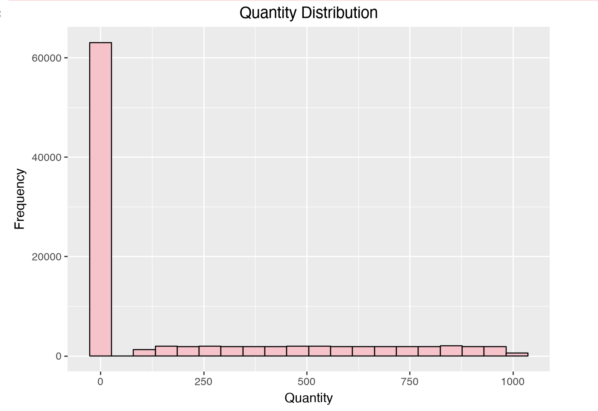

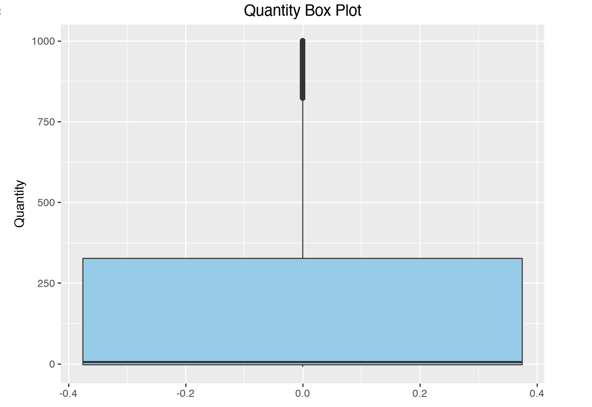

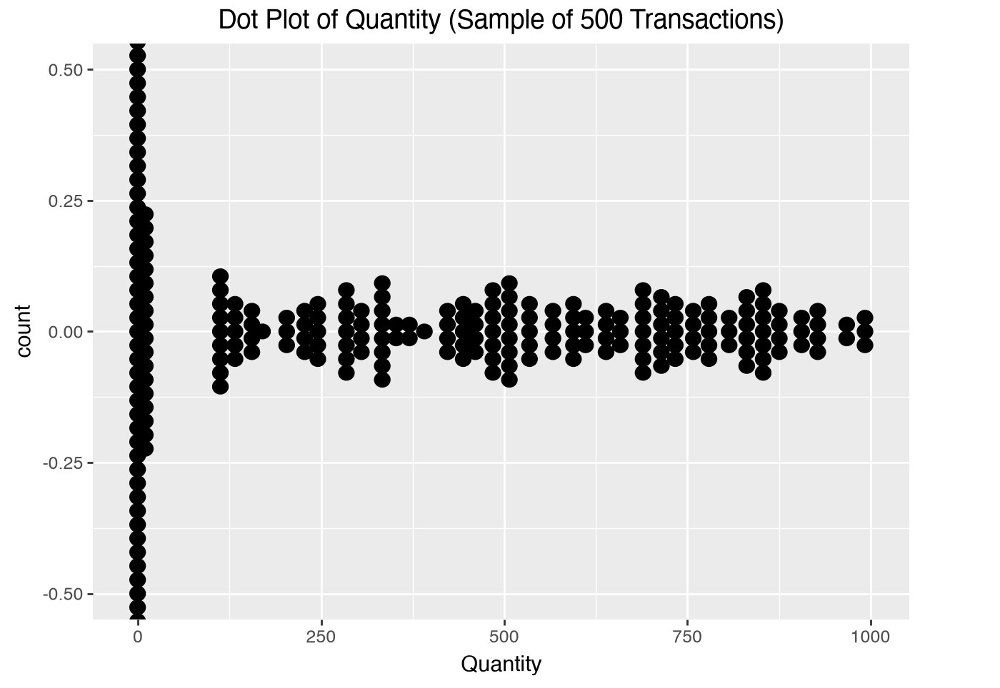

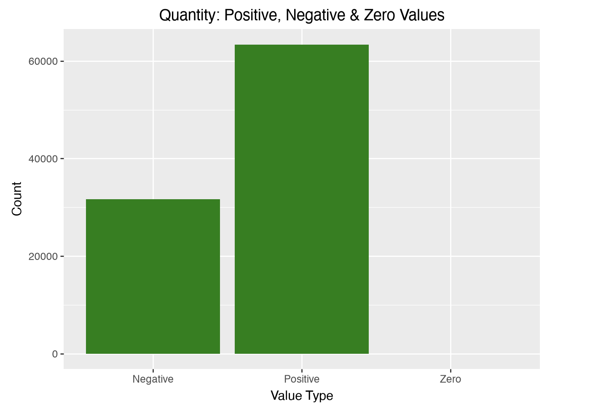

### 5.2 Categorical Feature Distributions

## Payment Method Distribution

The Payment Method column shows the frequency of each payment method used in the dataset. During analysis, multiple variations of the same payment method were identified due to inconsistent capitalization, spacing, and spelling (e.g., `Credit Card`, `credit card`, `creditcard`, `PayPal`, `pay pal`). These inconsistencies artificially increase the number of unique categories and can lead to inaccurate summaries and visualizations if not standardized.

### Visualization

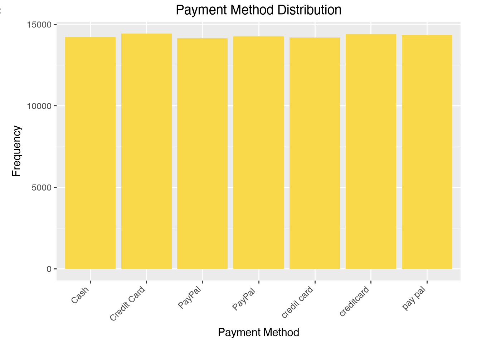

---

## Product Name Distribution

The Product Name column displays the frequency of products appearing in the dataset. Several product names were found to be truncated or incomplete (e.g., `Lapt`, `Coffee Ma`, `Smar`, `Tab`), resulting in duplicate representations of the same product. This increases the number of unique categories and affects the accuracy of product-level analysis.

### Visualization

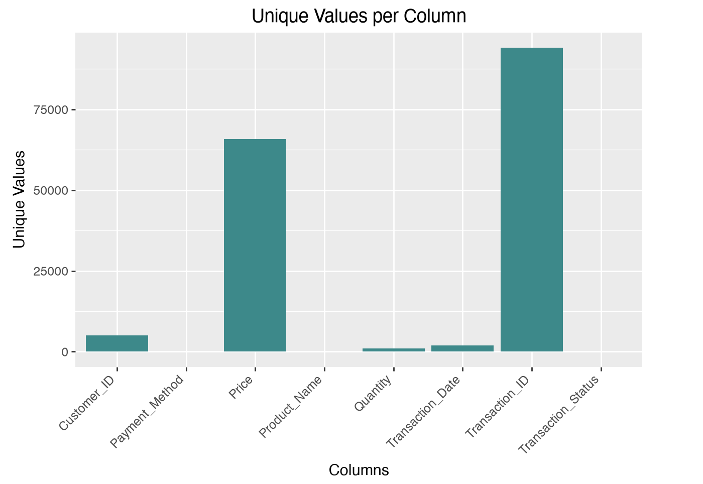

---

## Transaction Status Distribution

The Transaction Status column illustrates the frequency of each transaction status. Similar statuses are divided into separate categories because of inconsistent naming conventions, such as `Completed`, `completed`, and `complete`. Standardizing these values is necessary to ensure accurate reporting and analysis.

---

## 6. Relationship Analysis

### 6.1 Correlation Analysis

Correlation analysis was performed on the numerical features to identify possible relationships between variables. Since the raw dataset contains incorrect data types, missing values, and other invalid entries, the calculated correlations may not accurately represent the true relationships. A more reliable correlation analysis will be conducted after the data cleaning process.

---

### 6.2 Relationships Between Important Variables

The following relationships were explored during the initial analysis:

- **Transaction Date vs. Revenue:** Observes how revenue changes over time and identifies overall transaction trends.

- **Revenue by Transaction:** Compares the revenue generated across different transactions to identify variations in transaction values.

### Visualization

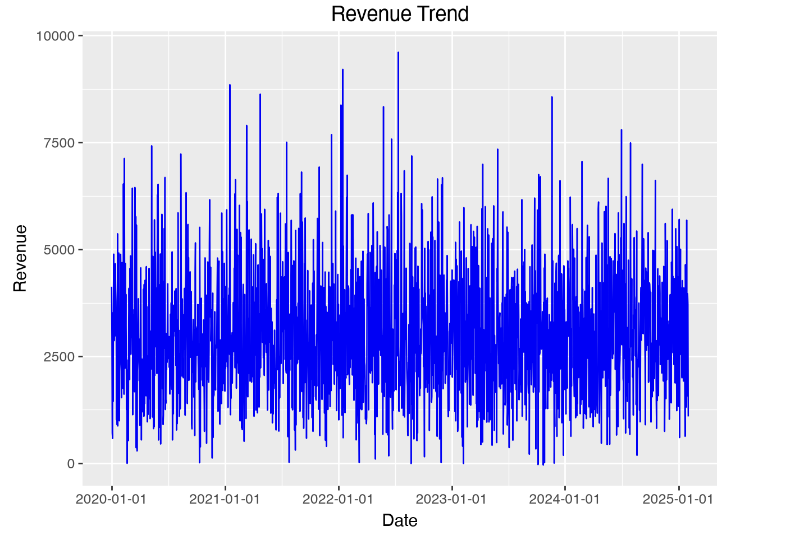
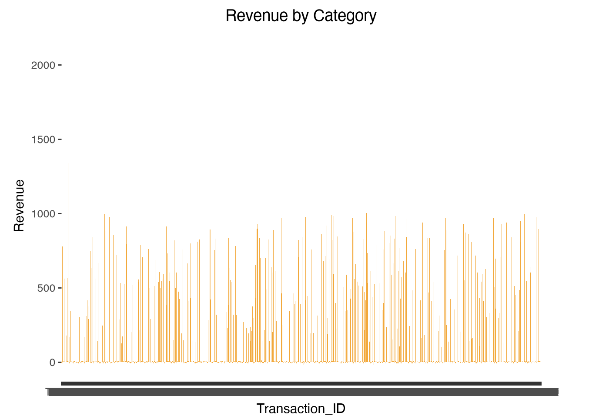

---

# 7. Data Quality Visualizations

## 7.1 Missing Values Visualization

This visualization highlights the distribution of missing values across all columns. It helps identify which features contain incomplete data and require attention during the cleaning process.

### Visual 1
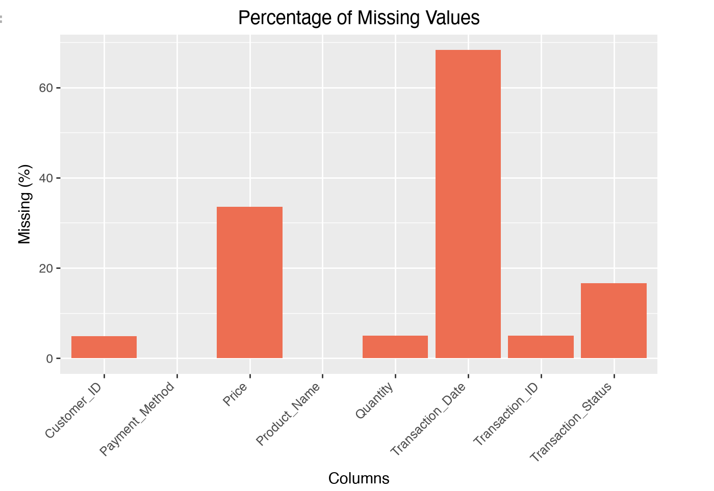

### Visual 2
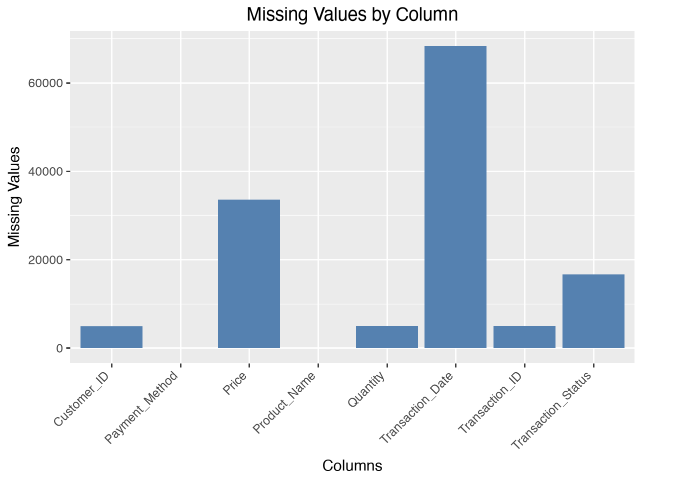

---

## 7.2 Duplicate Records Visualization

This chart compares the number of duplicate and unique records in the dataset, providing an overview of duplicate entries that may affect analysis accuracy.

### Visual

---

## 7.3 Data Type Distribution

The dataset contains both numerical and categorical features. Some columns, such as **Price** and **Transaction_Date**, are stored with incorrect data types and require conversion during preprocessing.

**Data types are summarized using a table (`df.dtypes`) rather than a visualization.**

---

## 7.4 Outlier Plots

Outlier plots are used to identify unusually high or low numerical values. The box plot highlights potential outliers in the **Quantity** column, while the histogram shows its overall distribution.

### Visual 1

### Visual 2

---

## 7.5 Invalid Value Counts

This visualization summarizes invalid numerical entries by categorizing quantity values into positive, zero, and negative groups. It helps identify records that violate expected business rules.

### Visual

---

## 7.6 Category Distributions

These visualizations display the distribution of categorical values and reveal inconsistencies such as duplicate categories, formatting issues, and excessive unique values.

### Visual 1

### Visual 2

---

## 7.7 Correlation Heatmap

A correlation heatmap can be be used to visualize relationships between numerical variables. Since the dataset contains limited numerical features and some invalid values, the observed correlations should be interpreted cautiously before cleaning.

---

## 7.8 Other Data Quality Visualizations

Additional visualizations highlight specific data quality problems that are not covered in the previous sections.

### Visual 1
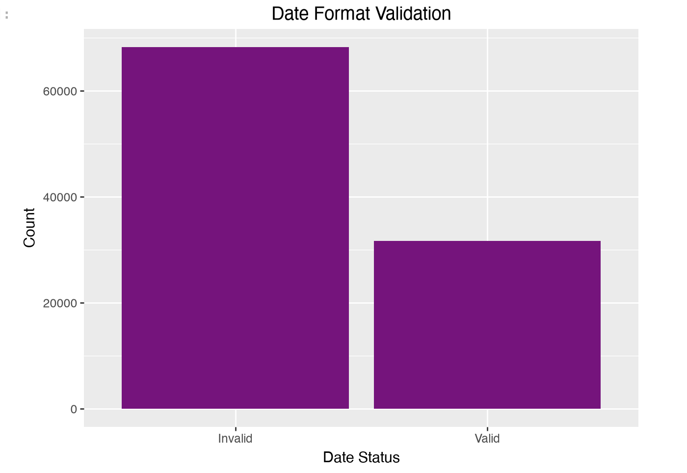

### Visual 2
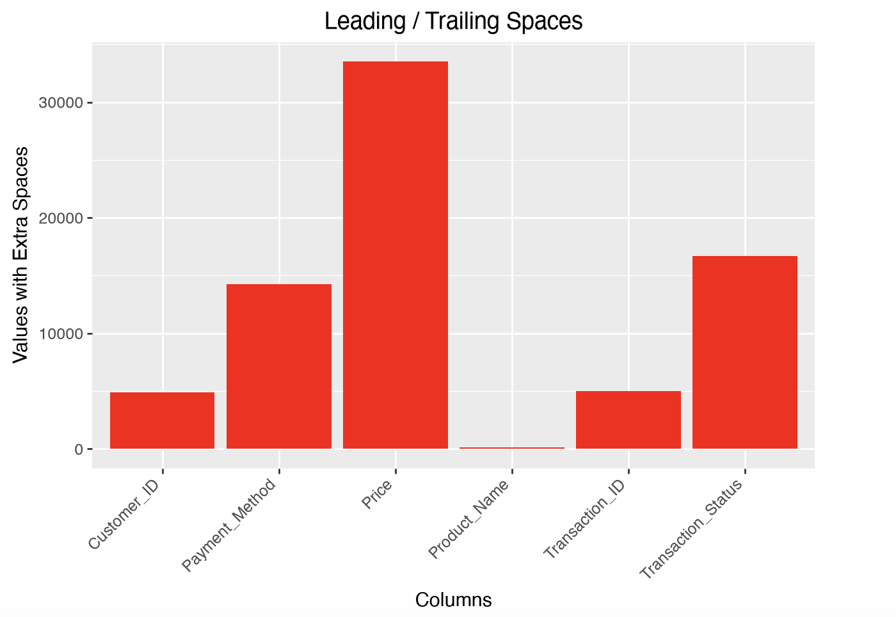

### Visual 3

---

## 8. Key Findings

- The dataset contains **100,000** financial transactions.
- Missing values and empty strings are present in multiple columns.
- Duplicate records were detected.
- **Price** and **Transaction_Date** have incorrect data types.
- Negative values were found in the **Quantity** and **Price** columns.
- Invalid and inconsistent date formats exist in the dataset.
- Product names contain incomplete or truncated values.
- Payment methods and transaction statuses have inconsistent naming conventions.
- Leading and trailing spaces create duplicate categories.
- Data cleaning is required before performing further analysis or building predictive models.

---

## 9. Proposed Data Cleaning Plan
- Handle Missing Values
- Remove Duplicate Records
- Correct Data Types
- Standardize Categorical Values
- Fix Formatting Issues
- Remove Leading and Trailing Spaces
- Correct truncated product names
- Validate the Cleaned Dataset
- Prepare the Dataset for Further Analysis